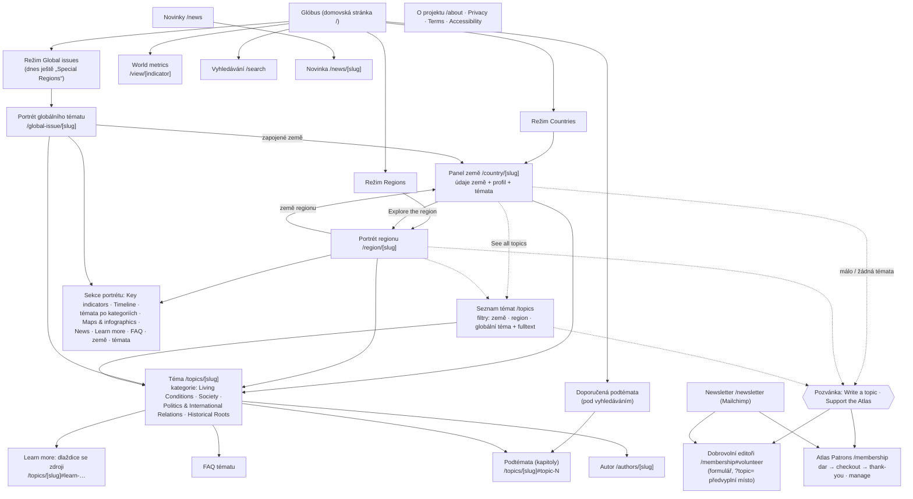
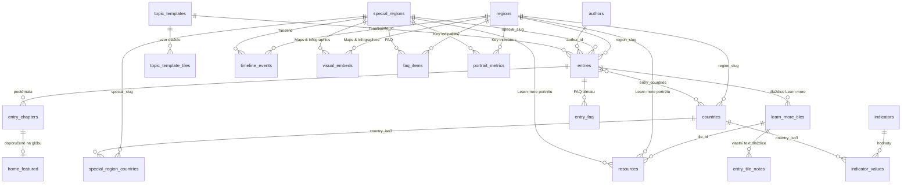

# Mapa webu: objekty, vztahy a navigace

> Část architektonické dokumentace Atlas of Today's World — přehled a mapa kapitol
> v [`ARCHITEKTURA.md`](../../ARCHITEKTURA.md). Tahle stránka je určená pro prezentaci
> projektu a pro editory, kteří plní obsah: co na webu existuje, jak spolu věci
> souvisejí, kde se vyplňují (admin) a kde se zobrazují. Vztahy jsou odvozené
> z kódu a databáze (stav říjen 2026); u každého objektu je tabulka v DB.

## 1. Navigace návštěvníka

Web stojí na glóbu. Mapové stránky (země, region, globální téma, novinka) se otevírají
jako panel nad glóbem; stránky „na celou šířku" (seznam témat, téma, Atlas Patrons…)
zmenší glóbus do okénka vlevo dole, kterým se dá vrátit zpět.

Hlavní menu: Topics, News (jen když je zapnutý přepínač `news` ve feature flags), About,
Support the Atlas, Atlas Patrons. Patička: Newsletter a právní stránky.

## 2. Obsahový model (databáze)

Zjednodušeno na vztahy, které editor potřebuje znát; technické tabulky (účty, role,
audit, rate limity) jsou v kapitole [Databáze](05-databaze.md).

### 2.1 Místa: země, regiony, globální témata

| Objekt | Tabulka | Kde se plní | Poznámka |
|---|---|---|---|
| Region | `regions` | Admin → Regions & countries | Úvod, hero foto, timeline nadpis, `portrait_status` (`populated` = napsaný, `skeleton` = šedý „v přípravě" s výzvou k podpoře). |
| Země | `countries` | Admin → Regions & countries → země | Patří do jednoho regionu (`region_slug`); profil `profile_html`, tagline, doporučené ukazatele. |
| Globální téma (dnes „Special region") | `special_regions` (`kind = 'issue'`) | Admin → Special regions | Skupina zemí přes `special_region_countries` (např. Migration, War in Ukraine). `kind = 'region'` je vlastní skupina zemí. |
| Vlastní mapová oblast | `map_areas` | Admin → Custom map areas | Polygon na mapě, téma se k ní může vázat (`entries.area_id`). |
| Ukazatel (World metrics) | `indicators` + `indicator_values` | Admin → Map data layers | Hodnoty po zemích a letech; barvení glóbu `/view/[indicator]`, karty v panelu země. |

### 2.2 Témata a podtémata

**Téma** je řádek `entries` s `kind = 'entry'` (stejná tabulka drží i novinky, `kind = 'news'`).
Plní se v Admin → Articles, schvaluje v Admin → Article approvals.

| Část tématu | Tabulka | Co to je |
|---|---|---|
| Téma | `entries` (`kind = 'entry'`) | Titulek, shrnutí a body shrnutí, obálka, autor, kategorie, SEO. Stav `draft` → `pending` (ke schválení) → `published`; `planned` = ohlášené, zatím nenapsané (v portrétu šedé). |
| Kategorie | `entries.category` | V DB pět kategorií novinek; portrét je skládá do čtyř skupin: Living Conditions, Society, **Politics & International Relations** (= Political System + International Relations), Historical Roots. |
| Podtémata (kapitoly) | `entry_chapters` | Dlaždice s fotkou v levé části tématu, každá s textem, shrnutím a volitelně audiem. Max. 12 na téma. Odkaz `#topic-N`. |
| Learn more | `learn_more_tiles` → `resources`, `entry_tile_notes` | Dlaždice se zdroji (videa, přednášky, články, vzdělávací zdroje, statistiky…); každé téma má vlastní sadu zkopírovanou ze **šablony** (`topic_templates`, Admin → Topic templates). Dlaždice nese odkazy (`resources.tile_id`) a/nebo vlastní text. |
| FAQ tématu | `entry_faq` | Otázky a odpovědi na konci tématu (i pro vyhledávače). |
| Autor | `authors` | Profil s fotkou, bio a positionality; stránka `/authors/[slug]`. Admin → Author profiles. |
| Doporučená podtémata | `home_featured` | Dva sloty na glóbu pod vyhledáváním (Admin → Home page); prázdný slot = nejnovější podtéma. |

**Kde se téma ukáže** (stejné pravidlo počítá i čísla na glóbu, `features/topics/map-counts.ts`):

- u **země**, když je země v `entry_countries`, nebo je téma přiřazené jejímu regionu
  (`region_slug`) či globálnímu tématu, do kterého země patří (`special_slug`);
- u **regionu**, když má téma jeho `region_slug` nebo je u některé jeho země;
- u **globálního tématu**, když má téma jeho `special_slug`;
- `entries.map_layers` (countries / regions / issues) určuje, ve kterých režimech glóbu
  se téma počítá — např. regionální téma jen v režimu Regions.

Obsah se píše **po regionech** (dnes Middle East, brzy Eastern Europe) a připíná se na
jejich země; místa bez témat ukazují pozvánku „Write a topic" (formulář dobrovolného
editora s předvyplněným místem) a „Support the Atlas".

### 2.3 Portrét regionu a globálního tématu

Jedna komponenta `Portrait` pro region i globální téma; nenapsané sekce jsou šedé
s výzvou k podpoře (ne skryté).

| Sekce | Tabulka | Vazba |
|---|---|---|
| Key indicators | `portrait_metrics` (+ ukazatele zemí) | `region_slug` / `special_slug` |
| Timeline | `timeline_events` | `region_slug` / `special_slug` |
| Témata po kategoriích | `entries` | viz 2.2 (včetně `planned`) |
| Maps & infographics | `visual_embeds` | `region_slug` / `special_slug`; jen povolení poskytovatelé iframe |
| News | `entries` (`kind = 'news'`) | země / region |
| Learn more | `resources` (`kind`) | `region_slug` / `special_slug` |
| FAQ | `faq_items` | `region_slug` / `special_slug` |
| Země | `countries` / `special_region_countries` | — |

Timeline a infografiky dnes patří **k portrétu** (regionu / globálnímu tématu), ne
k jednotlivému tématu; téma má podtémata, Learn more a FAQ.

### 2.4 Podpora a komunita

| Objekt | Tabulka | Kde se plní / čte |
|---|---|---|
| Atlas Patrons (členství, dary) | `memberships` | Veřejně `/membership` → checkout → thank-you, `/membership/manage`; Admin → Patron memberships. |
| Dobrovolní editoři | `volunteer_applications`, `volunteer_settings` | Formulář na `/membership#volunteer`; Admin → Volunteer editors. |
| Newsletter | — (Mailchimp) | `/newsletter`, double opt-in mimo naši DB. |

## 3. Admin

| Oblast | Cesta | Co spravuje |
|---|---|---|
| Overview | `/admin` | přehled |
| Articles | `/admin/content` | témata i novinky (`entries`), podtémata, Learn more, FAQ, SEO, jazykové verze, náhled |
| Article approvals | `/admin/approvals` | schvalování `pending` → `published` |
| Author profiles | `/admin/authors` | `authors` |
| Topic templates | `/admin/topic-templates` | `topic_templates`, `topic_template_tiles` |
| Home page | `/admin/home` | `home_featured` |
| URL redirects | `/admin/redirects` | `redirects` |
| Regions & countries | `/admin/regions` | `regions`, `countries`, portrét regionu (timeline, infografiky, FAQ, zdroje, metriky) |
| Special regions (Global issues) | `/admin/global-issues` | `special_regions` a jejich portrét |
| Map data layers | `/admin/data` | `indicators`, `indicator_values` |
| Custom map areas | `/admin/areas` | `map_areas` |
| Map appearance | `/admin/appearance` | `site_theme` |
| Accounts & invitations, Roles & permissions | `/admin/accounts`, `/admin/roles` | účty, pozvánky, role (viz [Autentizace a role](06-autentizace-role.md)) |
| Volunteer editors | `/admin/volunteers` | přihlášky dobrovolníků |
| Patron memberships | `/admin/members` | `memberships` |
